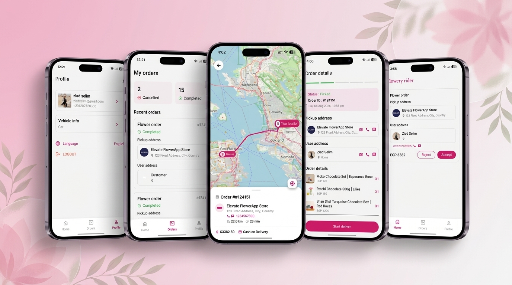

# Flowery Driver App — Flutter Delivery Driver Application

<p align="center">
  
</p>

<p align="center">
  
</p>

<p align="center">
  
  
  
  
  
  
</p>

> Developed a Flutter delivery-driver application with secure authentication, live order management, and bilingual (English/Arabic) support.

Production-ready driver app for the **Flowery** flower delivery platform. Handles the full driver lifecycle — authentication & onboarding, order discovery, acceptance/rejection, real-time tracking from store to customer, history and profile management — built for scale and maintainability.

---

## Table of Contents

- [Highlights](#highlights)
- [Features](#features)
- [Tech Stack](#tech-stack)
- [Architecture](#architecture)
- [Project Structure](#project-structure)
- [ Localization (EN / AR)](#localization-en--ar)
- [Real-Time Tracking & Maps](#real-time-tracking--maps)
- [Notifications](#notifications)
- [Screenshots](#screenshots)
- [Getting Started](#getting-started)
- [Firebase Setup](#firebase-setup)
- [Code Generation](#code-generation)
- [Build & Release](#build--release)
- [Contributing](#contributing)

---

## Highlights

- **Secure authentication** with REST API + `flutter_secure_storage`, login, forget/reset password, and driver application (apply) flow with image uploads.
- **Live order management** — pending orders feed with pagination & pull-to-refresh, infinite scroll, accept/reject, order details, history and driver-order details.
- **Real-time driver & order tracking** using **Firebase Cloud Firestore** streams, live GPS updates via `geolocator` / `location`, with turn-by-turn navigation from store to customer.
- **Routing via OSRM** (`router.project-osrm.org`) with `google_maps_flutter` + `flutter_map` / `flutter_polyline_points` and OpenStreetMap tiles, distance/duration, recenter & auto-fit bounds.
- **Feature-First Clean Architecture** with **Repository Pattern** and **Bloc/Cubit**, separating `api` / `data` / `domain` / `presentation` per feature.
- **REST integration** with `Dio` + `Retrofit` + `pretty_dio_logger`, codegen via `json_serializable` / `build_runner`.
- **Push & local notifications** via **Firebase Cloud Messaging** + `flutter_local_notifications`, with DI-initialized `NotificationInitializer`.
- **Bilingual** English/Arabic via `easy_localization` (`assets/translations/en.json`, `ar.json`) with RTL support.
- **Agile, scalable codebase** — `get_it` + `injectable` DI, `equatable`, `logger`, Git + pull requests, reusable core widgets/theme.

## Features

| Area | Details |
|------|---------|
| **Onboarding & Splash** | `SplashScreen` → auth check, `OnboardingScreen` with Lottie (`assets/lottie/`) |
| **Auth** | Login, Forget Password, Reset Password, Apply Now (countries, vehicles, documents, image_picker + firebase_storage upload), Success Apply |
| **Home / Orders** | Pending orders list (`HomeScreen`, `OrderCard`, `OrderDetailPage`), pagination, `Accept/Reject Buttons`, shimmer/skeleton loading |
| **Order Tracking** | `OrderTrackPage` with `OrderStatusBanner`, `OrderProgressBar`, `OrderActionButton`, `watchOrderState` Firestore stream, `updateOrderState` |
| **History** | `HistoryPage`, `DriverOrderDetailsPage`, stats, recent orders, summary sections |
| **Driver Map** | `DriverMapPage` (`flutter_map`, OSRM), `MapMarker` (driver/store/user), `MapBottomSheet` with distance/duration, live position stream |
| **Profile** | Edit Profile, Edit Vehicle Info, Reset Password, Logout |
| **App Shell** | `AppSectionsPage` (bottom navigation), `AppRouter` with `PageTransitions` |
| **Common** | `AppColors` (`#D21E6A` primary), `AppTheme`, `AppTextStyle`, cached images, shimmer/skeletonizer, badges, webview |

## Tech Stack

| Category | Packages |
|----------|----------|
| **Framework** | `flutter` (SDK ^3.11.1), `cupertino_icons` |
| **State Management** | `flutter_bloc` ^9.1.1 (Bloc/Cubit) |
| **DI** | `get_it` ^9.2.1, `injectable` ^3.0.0, `injectable_generator` |
| **Networking** | `dio` ^5.9.2, `retrofit` ^4.9.2, `retrofit_generator`, `pretty_dio_logger` |
| **Serialization** | `json_annotation`, `json_serializable`, `build_runner` |
| **Firebase** | `firebase_core`, `cloud_firestore`, `firebase_messaging`, `firebase_storage`, `firebase_crashlytics` |
| **Storage** | `flutter_secure_storage` ^10.0.0 |
| **Maps & Location** | `google_maps_flutter`, `flutter_map` ^7.0.2, `latlong2`, `geolocator` ^13.0.2, `location` ^8.0.1, `flutter_polyline_points`, `url_launcher`, OSRM HTTP |
| **Localization** | `easy_localization` ^3.0.8 |
| **UI** | `cached_network_image`, `shimmer`, `skeletonizer`, `google_fonts`, `flutter_svg`, `pinput`, `badges`, `lottie`, `webview_flutter` |
| **Utils** | `equatable`, `image_picker`, `permission_handler`, `flutter_local_notifications`, `logger` |
| **Tooling** | `flutter_lints`, `test`, `mockito` |

## Architecture

**Feature-First Clean Architecture + Repository Pattern + Bloc/Cubit**

```
lib/
├── app.dart
├── main.dart
├── firebase_options.dart
├── config/
│   ├── base/
│   ├── dependency_injection/  # di.dart, di.config.dart, firestore_module.dart (get_it + injectable)
│   ├── mapper/
│   └── routes/                # app_router.dart, routes.dart, page_transitions.dart
├── core/
│   ├── error/                 # failures, exceptions
│   ├── network/               # DioHelper, interceptors
│   ├── firebase/              
│   ├── notifications/         # fcm_service.dart, local_notification_service.dart, notification_initializer.dart
│   ├── storage/               # secure_storage_service.dart
│   ├── theme/                 # app_colors.dart, app_theme.dart, app_text_style.dart
│   ├── resources/             # app_svgs.dart, app_lottie.dart, app_png.dart
│   ├── utils/ & widgets/      # primary_button, custom_appbar, custom_snack_bar, etc.
│   └── localization_constants/
└── features/
    ├── splash/
    ├── onboarding/
    ├── auth/                  # login, forget_password, apply (api/data/domain/presentation)
    ├── app_section/
    ├── orders/                # home, history, order_track (entities, repos, use_cases, cubits)
    ├── driver_map/            # domain/entities/driver_map_params.dart, presentation/pages/driver_map_page.dart
    ├── profile/               # edit_profile, edit_vehicle_info, reset_password
    └── notifications/
```

**Data flow per feature:**
`Presentation (Cubit/Widget)` → `Domain (Entity + Repository interface + UseCase)` → `Data (RepositoryImpl + DataSource)` → `Api (Retrofit ApiClient + Firestore DataSource + DTO/Model)`

Example (`orders`): `HomeCubit` → `GetAllPendingOrder` / `GetDriverOrdersUseCase` → `OrderPageRepoImpl` → `OrderPageRemoteDataSourceImpl` (`order_page_api_client.dart`) + `OrderPageFirestoreDataSourceImpl` → Firestore + REST.

DI is centralized in `lib/config/dependency_injection/di.dart` (`configureDependencies()`), called in `main()` before `NotificationInitializer` and `EasyLocalization`.

## Project Structure

```
assets/
├── images/        # panar.png (banner), flowrylogo.png, bg.png
├── svgs/
├── lottie/        # onboarding.json
├── translations/  # en.json, ar.json
└── data/
lib/features/orders/
├── api/           # api_client (retrofit), datasources/*_firestore_data_source_impl.dart
├── data/          # datasources, models/*_dto.dart, repositories/*_repo_impl.dart
├── domain/        # entities, repositories, use_cases (watch_order_state, update_order_state, etc.)
└── presentation/  # home, history, order_track (cubit, pages, widgets)
```

Key use cases: `watch_order_state_usecase`, `update_order_state_usecase`, `set_driver_location_use_case`, `delete_driver_location_use_case`, `get_all_pending_order`, `get_driver_orders_use_case`, `get_order_user_info_use_case`, `save_current_order_usecase`, `create_notification_request_use_case`.

## Localization (EN / AR)

- `easy_localization` with `path: assets/translations/` (`lib/core/resources/app_value.dart: AppKeys.translationPath`).
- `supportedLocales: [en, ar]` initialized in `main.dart` (`EasyLocalization.ensureInitialized()`).
- `MaterialApp` wired with `context.localizationDelegates`, `supportedLocales`, `locale` in `lib/app.dart:12-15`.
- All user-facing strings via `assets/translations/en.json` / `ar.json` + `core/localization_constants/*` (e.g., `auth_constants`, `onboarding_constants`, `general_constants`).
- RTL layout handled automatically by Flutter when `ar` locale active.

## Real-Time Tracking & Maps

- **Driver location:** `Geolocator.getCurrentPosition` + `Geolocator.getPositionStream(distanceFilter: 10)` in `lib/features/driver_map/presentation/pages/driver_map_page.dart:114-131`.
- **Permissions:** runtime check for `LocationPermission.denied` / `deniedForever` and service enabled; fallback UI with `Open Settings` / `Retry`.
- **Routing:** OSRM `GET https://router.project-osrm.org/route/v1/driving/{lon,lat};{lon,lat}?geometries=geojson&overview=full` (`driver_map_page.dart:178-183`), decoded to `List<LatLng>`, distance/duration displayed in `MapBottomSheet`.
- **Map:** `flutter_map` with `TileLayer` (`tile.openstreetmap.org`), `PolylineLayer` (primary `#D21E6A` to store, blue `#2196F3` to customer), `MarkerLayer` via `MapMarker` + `mapMarkerDimensions`, auto-fit via `CameraFit.bounds`.
- **Firestore live sync:** `OrderDetailsFirestoreDataSourceImpl` / `OrderPageFirestoreDataSourceImpl` streams + `SetDriverLocationUseCase` / `DeleteDriverLocationUseCase` to write driver coords; `WatchOrderStateUseCase` for order lifecycle (`inProgress`, `completed`, etc.).

## Notifications

- `firebase_messaging` + `flutter_local_notifications` via `core/notifications/` (`fcm_service.dart:1`, `local_notification_service.dart:1`, `notification_initializer.dart:1`).
- Initialized in `main.dart:18` with `getIt<NotificationInitializer>().initialize()` after `Firebase.initializeApp`.
- `permission_handler` for notification permission, `create_notification_request_use_case` for backend registration.
- `firebase_crashlytics` enabled for crash reporting.

## Screenshots

> Banner is `assets/images/panar.png` — used as the repository social preview and in-app header.

| Home (Pending Orders) | Order Detail | Driver Map (OSRM) | History |
|---|---|---|---|
| `HomeScreen` + `OrderCard` | `OrderDetailPage` / `OrderDetailsScreen` | `DriverMapPage` live route | `HistoryPage` + `DriverOrderDetailsPage` |

Add screenshots to `assets/images/` and reference them here:

```md


```

---

## Getting Started

### Prerequisites

- Flutter SDK `^3.11.1` (`flutter --version`)
- Dart SDK (bundled with Flutter)
- Android Studio / Xcode, plus Firebase project with `google-services.json` / `GoogleService-Info.plist`
- Node / Firebase CLI if you manage Firestore rules (`firebase.json`, `firestore.rules`)

### Installation

```bash
# 1. Clone
git clone <your-repo-url>.git
cd flower_driver_app

# 2. Install dependencies
flutter pub get

# 3. Generate code (injectable, retrofit, json_serializable)
dart run build_runner build --delete-conflicting-outputs

# 4. Run
flutter run
# or specify device
flutter run -d android
flutter run -d ios
```

### Environment

- `DioHelper.init()` is called in `main.dart:16` — configure base URL / interceptors in `lib/core/network/dio_helper.dart`.
- Secure storage keys in `lib/core/storage/secure_storage_service.dart`.
- Translations in `assets/translations/en.json` and `ar.json` — add keys there and regenerate if using codegen.

## Firebase Setup

1. Create a Firebase project and enable **Authentication**, **Cloud Firestore**, **Cloud Messaging**, **Storage**, **Crashlytics**.
2. Run `flutterfire configure` to regenerate `lib/firebase_options.dart` and platform files.
3. Deploy rules/indexes if needed:
   ```bash
   firebase deploy --only firestore:rules
   firebase deploy --only firestore:indexes
   ```
4. Add `google-services.json` to `android/app/` and `GoogleService-Info.plist` to `ios/Runner/` (ignored by `.gitignore` — do not commit).
5. For FCM, upload APNs key (iOS) in Firebase Console and ensure `android/app/build.gradle.kts` has `google-services` plugin.

## Code Generation

This project uses code generation. Re-run after changing `@injectable`, `@RestApi`, or `@JsonSerializable` models:

```bash
dart run build_runner watch --delete-conflicting-outputs
# one-off
dart run build_runner build --delete-conflicting-outputs
```

Generated files: `*.g.dart`, `di.config.dart`, `order_page_api_client.g.dart`, etc. — do not edit manually.

Helper script: `create_feature.dart` / `create_feature.bat` scaffolds a new feature folder (`api/data/domain/presentation`) — useful for adding features consistently.

## Build & Release

```bash
# Analyze & test
flutter analyze
flutter test

# Android APK / App Bundle
flutter build apk --release
flutter build appbundle --release

# iOS (on macOS)
flutter build ios --release
```

Version is `1.0.0+1` (`pubspec.yaml:19`). Bump with `--build-name` / `--build-number` or edit `pubspec.yaml`.

## Contributing

Collaborated within an **agile team using Git and pull requests** — this repo follows the same workflow:

1. Create a feature branch: `git checkout -b feature/<name>`
2. Commit with conventional messages: `feat:`, `fix:`, `refactor:`
3. Push and open a PR against `main` — ensure `flutter analyze` and tests pass
4. Request review; squash/merge after approval

Maintain **Feature-First Clean Architecture** boundaries (don't cross-import between features except via `core` or `domain` interfaces) and keep `lib/core` reusable.

---

<p align="center">
  Built with Flutter · Clean Architecture · Bloc · Firebase · OSRM
</p>
